# Why DID he go to Calais?

Here we commemorate in pictorial form the time Gareth and Tom made a trip to Calais from Edinburgh, and all for no reason other than the comedian Mark Watson hinted it might be funny. They left around 3pm, 3 hours into the 36 hour show, and returned 10pm the following day. Those 31 hours were to be long and arduous as they did battle with French customs, British railways, and The Terror and these pictures chronicle the trip in an appallingly vague manner.

<a href="images/DSC00044.JPG">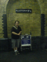</a>

After an exciting train journey Gareth arrives at Kings Cross and considers Hogwarts as his next port of call

 

'Just through here Tom!' Ok, off you go then...

 

<a href="images/DSC00046.JPG">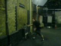</a>

Gareth attempts the impossible. It proved to be impossible.

 

<a href="images/DSC00047.JPG">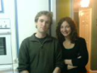</a>

Some more training later, and we found our Driver (Ed, left) and his Misses (Lara, right) who would speed us to France

 

<a href="images/DSC00048.JPG">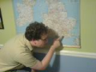</a>

Gareth plots the next stage of the journey

 

<a href="images/DSC00049.JPG">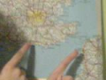</a>

So close!

 

This was written on the side of a Polish lorry. It's amazing what some people will haul around.

 

<a href="images/DSC00051.JPG">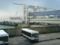</a>

The ferryport in picturesque Dover. Here you can see the P&amp;O steed of the seas that will bear us on our way.

 

<a href="images/DSC00052.JPG">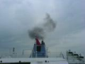</a>

The environmental cost for this kind of trip is high

 

<a href="images/DSC00053.JPG">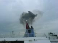</a>

And keeps getting higher. Won't somebody think of the children?

 

<a href="images/DSC00054.JPG">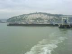</a>

Goodbye England. I do hope my GCSE French is up to the task...

 

Gareth phones a different comedy show about the cake trip to Calais. The whore.

 

<a href="images/DSC00056.JPG">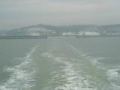</a>

England vanishing into the morning mist. It's all quite poetic really.

 

<a href="images/DSC00057.JPG">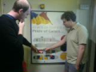</a>

Poetic or not, we're on a boat and there really is only one place to go next...

 

<a href="images/DSC00058.JPG">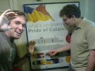</a>

After driving us all the way from Gatwick, Ed wanted to be in a picture

 

<a href="images/DSC00059.JPG">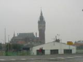</a>

Calais is even more unpleasant than Dover. In all our time, this was the nicest building we could find (the church that is, not the shed).

 

<a href="images/DSC00060.JPG">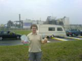</a>

More delightful images of Calais. If you look closely, you can see the bemused look on the drivers face.

 

<a href="images/DSC00061.JPG">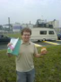</a>

38 minutes in France, a conversation with a frenchman (in French!) and the sausage-lental-experience as proof!

 

<a href="images/DSC00062.JPG">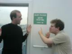</a>

'Back to England! I could sing!' 'SSSSSSHHHHH' (Note: I'm neither as bald, nor camp as this photo would suggest)

 

<a href="images/DSC00063.JPG">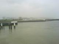</a>

Aurevoir France - it feels as if we've only been here a short time. Here's a departing shot of a lovely caravan park.

 

<a href="images/DSC00064.JPG">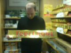</a>

We were going to bring this back for you all, but thought it might be considered a dangerous weapon during The Terror...

All photos taken by [Tom Natt](www.tomnatt.com), using the camera in his phone. Who said they were useless? This website put together for Gareth to begin his ego trip into the world of cult internet fame.

<b></b>

 

 

&nbsp;  <a href="https://www.bbc.co.uk/programmes/m000240n" target="_blank"><iframe frameborder="0" height="330px" src="https://embed.acast.com/614b8bf429d566001531b411?episode-order=asc&amp;feed=true" width="100%"></iframe>  </a>

